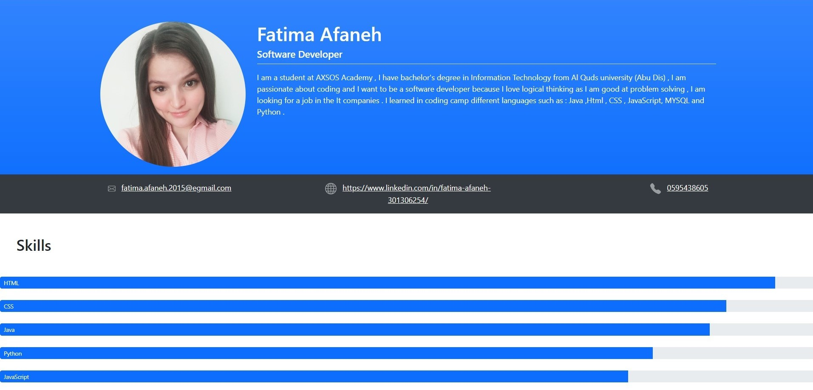

# Hello There my Name is Fatima Afaneh

I am a student at AXSOS Academy , I have bachelor's degree in Information Technology from Al Quds university (Abu Dis) , I am passionate about coding and I want to be a software developer because I love logical thinking as I am good at problem solving , I am looking for a job in the It companies . I learned in coding camp different languages such as : Java ,Html , CSS , JavaScript, MYSQL and Python .

This is welcome page for my github to show mywork 

